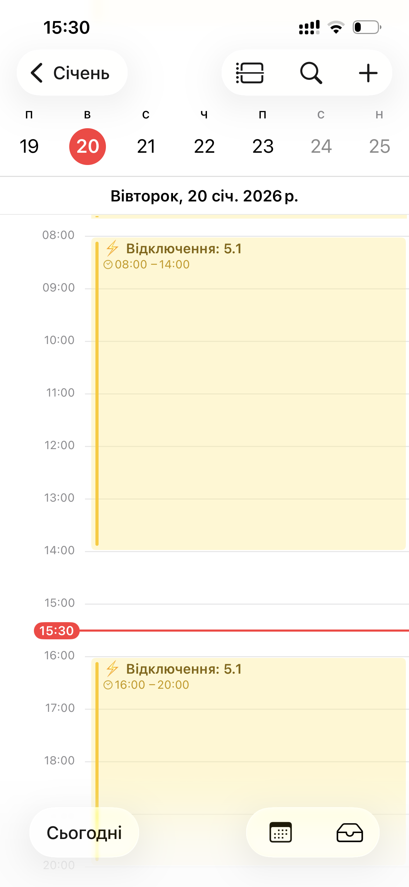
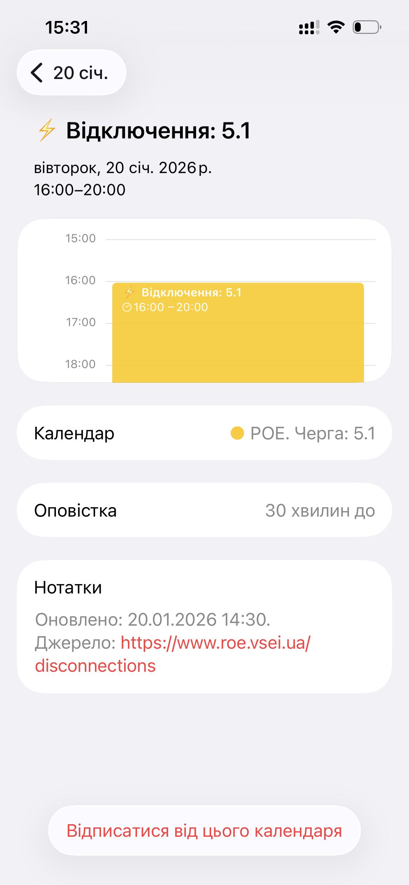

# ⚡ РОЕ Parser (Рівнеобленерго Календар)

Автоматизована система для генерації персоналізованих графіків відключень електроенергії у форматі `.ics` для мешканців Рівного та області.

## 🌟 Можливості
- **48 варіацій календарів:** Файли для кожної черги (1.1–6.2) з різними налаштуваннями сповіщень.
- **Гнучкі сповіщення:** Варіанти без звуку, за 30 хв, за 1 год або комбіновані (30хв + 1год).
- **Автооновлення:** Скрипт на Go автоматично збирає актуальні дані та оновлює календарі.
- **Легка інтеграція:** Працює з Google Calendar, Apple Calendar та Outlook.
- **Логування**: Веде файл `service.log` для моніторингу роботи.

## 📱 Як це виглядає
<p align="center">
  
  
  
  
</p>

## 📂 Структура проєкту
```text
roe-parser/
├── assets/             # Статичні ресурси проєкту
│   ├── img/            # Логотипи та іконки для веб-інтерфейсу
│   └── scr/            # Скріншоти роботи застосунку для опису
├── roe_service.exe   # Виконавчий файл
├── service.log       # Логи роботи (створюються автоматично)
└── data/             # # Згенеровані .ics файли (48 варіацій)
    ├── discos-1.1.ics
    ├── discos-1.1-30m.ics
    └── ...
├── models/             # Go-структури (WorkGroup, Alarm)
├── index.html          # Головна сторінка для вибору черги
└── main.go             # Основний скрипт парсингу та генерації

## 🛠 Керування службою (PowerShell Admin)

Відкрийте **PowerShell від імені адміністратора** та використовуйте наступні команди:

### 1. Створення (реєстрація) служби
Замініть шлях у лапках на реальний шлях до вашого файлу.
```powershell
New-Service -Name "ROEParsingService" `
            -BinaryPathName "C:\path\to\your\file\roe-parser.exe" `
            -DisplayName "ROE Outage Parser" `
            -StartupType Automatic

### 2. Запуск служби
```powershell
Start-Service "ROEParsingService"

### 3. Перевірка статусу
Щоб переконатися, що служба активна та працює без помилок:
```powershell
Get-Service "ROEParsingService"

### 4. Зупинка служби
```powershell
Stop-Service "ROEParsingService"

### 5. Повне видалення служби
Використовуйте цю команду для очищення системи або перед зміною шляху до EXE-файлу:
```powershell
sc.exe delete "ROEParsingService"